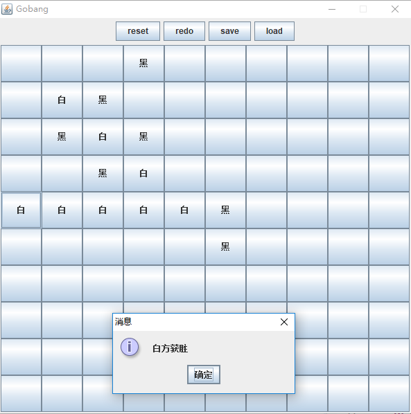

# Gobang Excercise
A simple Gobang GUI implemented by **Java Swing**, developed under **Eclipse 2019-12 (4.14.0)**
## Usage
- The white and the black plays alternatively
- Take back any steps by click the `redo` button
- Save and load game to disk file by Java Object Serialization
## UI
